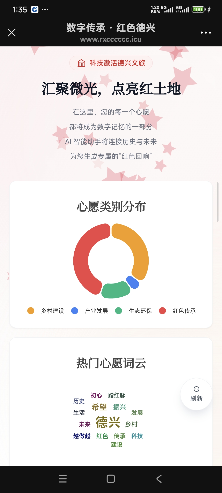
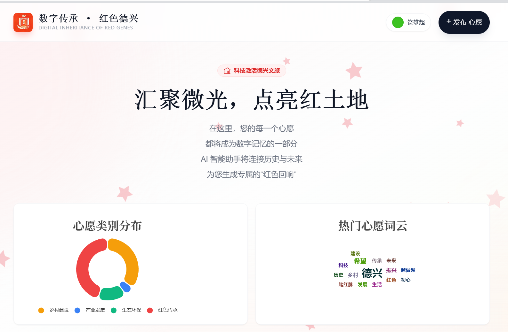

# 我们的心愿墙（ourwish_wall）

一个面向移动端的「红色文化主题」心愿墙项目：前端负责沉浸式展示与互动，后端提供心愿发布、评论点赞、统计分析与 AI 回响能力。

- 前端：Vue 3 + Vite + Pinia + Tailwind + Vant
- 后端：Flask + SQLAlchemy + PyMySQL
- 数据库：MySQL / MariaDB（建议 `utf8mb4`）

---

## ✨ 项目亮点

- **移动优先 UI**：适配手机浏览体验，包含欢迎身份引导、心愿卡片、图表看板。
- **完整互动链路**：发布心愿、点赞/取消点赞、评论/删评、删除心愿。
- **智能回响机制**：发布后先返回占位文本，后端异步生成 AI 回复并更新。
- **数据可视化**：按分类统计（饼图）+ 基于心愿内容的词云。
- **基础防刷能力**：对发布心愿接口进行频率限制（默认 5 秒内 1 次）。

---

## 📸 项目页面展示

下面展示项目在手机与桌面端的截图，以及用于快速体验的二维码，图片保存在 `img/` 目录下：

移动端预览（手机）：



桌面端预览（PC）：



网址:
https://www.rxcccccc.icu/wishes

扫码体验（二维码）：


## 🧱 技术栈

### 前端

- Vue 3
- Vite 4
- Pinia
- Vue Router
- Tailwind CSS
- Vant 4
- ECharts + echarts-wordcloud
- Axios

### 后端

- Python 3.10+
- Flask
- Flask-SQLAlchemy
- Flask-CORS
- PyMySQL
- python-dotenv
- jieba

---

## 📁 目录结构（核心）

```text
ourwish_wall/
├─ backend/                 # Flask 后端
│  ├─ app.py                # API 路由与错误处理
│  ├─ config.py             # 环境配置（读取 .env）
│  ├─ models.py             # Wish/Comment/Like 等模型
│  ├─ init_db.py            # 初始化数据库表
│  └─ services/
│     ├─ ai_service.py      # AI 回响服务（可切换本地/远程）
│     └─ text_filter.py     # 文本校验与过滤
├─ frontend/                # Vue 前端
│  ├─ src/api/index.js      # API 封装
│  ├─ src/stores/user.js    # 用户身份本地存储
│  ├─ src/components/       # 页面组件（表单/卡片/图表）
│  └─ vite.config.js        # 开发代理配置
├─ scripts/                 # 数据清理、压测脚本
├─ plans/                   # 方案文档与项目笔记
└─ README.md
```

---

## 🚀 本地开发快速开始

### 1) 后端启动

进入后端目录，安装依赖并初始化数据库：

```bash
cd backend
pip install -r requirements.txt
python init_db.py
python app.py
```

默认监听：`http://127.0.0.1:5000`

### 2) 前端启动

另开终端：

```bash
cd frontend
npm install
npm run dev
```

默认地址：`http://127.0.0.1:5173`

开发模式下，前端通过 Vite 代理将 `/api/*` 转发到后端。

---

## ⚙️ 环境变量配置

项目根目录已提供 `.env` 模板，可按需修改。常用变量如下：

- `FLASK_ENV`：`development` / `production`
- `SECRET_KEY`：Flask 密钥（生产务必更换）
- `DATABASE_URL`：完整数据库连接串（推荐生产）
- `DB_HOST` / `DB_PORT` / `DB_USER` / `DB_PASSWORD` / `DB_NAME`：分项数据库配置
- `CORS_ORIGINS`：允许跨域来源
- `AI_SERVICE_ENABLED`：是否启用远程 LLM
- `AI_API_KEY` / `AI_API_ENDPOINT` / `AI_MODEL`：AI 服务配置

> 提示：若设置了 `DATABASE_URL`，后端会优先使用该项。

---

## 🧩 核心业务说明

### 心愿分类（后端校验）

- `红色传承`
- `乡村建设`
- `产业发展`
- `生态环保`

### 内容规则

- 心愿内容最大长度：`500` 字
- 评论内容最大长度：`200` 字

### 限流规则（默认）

- 发布心愿：同一 IP 在 `5` 秒内最多 `1` 次

### AI 回响流程

1. 创建心愿时，先返回占位文本（如“回响中......”）。
2. 后台线程异步调用 AI 服务生成回复。
3. 前端可轮询单条心愿接口刷新 `ai_response`。

---

## 🔌 API 概览

基础前缀：`/api`

- `GET /health`：健康检查
- `GET /wishes`：分页获取心愿列表（可按分类过滤）
- `POST /wishes`：发布心愿
- `GET /wishes/:id`：获取单条心愿（含评论）
- `DELETE /wishes/:id`：删除心愿（仅发布者）
- `POST /wishes/:id/like`：心愿点赞/取消点赞
- `GET /wishes/:id/comments`：获取评论
- `POST /wishes/:id/comments`：新增评论
- `DELETE /wishes/:id/comments/:comment_id`：删除评论
- `POST /wishes/:id/comments/:comment_id/like`：评论点赞/取消点赞
- `GET /stats`：统计数据（类别统计 + 词云）

---

## 🏗️ 构建与部署（简版）

### 前端构建

```bash
cd frontend
npm run build
```

构建产物位于 `frontend/dist/`，可由 Nginx 托管。

### 后端生产运行（推荐 Gunicorn）

```bash
cd backend
gunicorn -w 4 -b 127.0.0.1:5000 app:app
```

建议结合 `systemd + Nginx` 使用，详见：`DEPLOYMENT.md`。

---

## 🧪 调试与排查

- 后端无法连接数据库：优先检查 `.env` 的数据库参数与 MySQL 权限。
- 前端请求失败：检查 `frontend/vite.config.js` 代理目标与后端服务状态。
- AI 回响未更新：确认 `AI_SERVICE_ENABLED` 与 `AI_API_KEY` 配置，查看后端日志。

---

## 🗺️ 后续可扩展方向

- 增加鉴权体系（如管理员审核、敏感操作鉴权）
- 引入数据库迁移工具（Alembic）替代手动初始化
- 完善自动化测试（接口测试 + 前端 E2E）
- 增加多维统计（时间趋势、用户活跃度）

---

## 🤝 贡献说明

欢迎提交 Issue / PR。建议在改动前先阅读：

- `backend/app.py`
- `backend/config.py`
- `frontend/src/api/index.js`
- `.github/copilot-instructions.md`
---

## 📄 许可证

本项目许可证见仓库根目录 `LICENSE` 文件。

